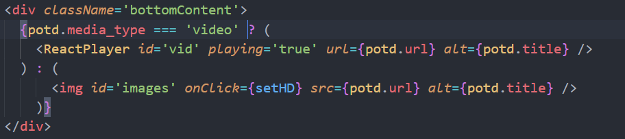
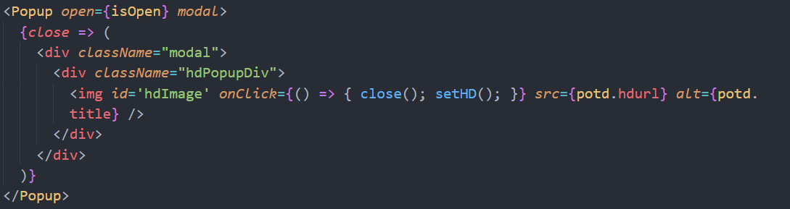

# Nasa Photo of The Day

## Created By: Mark Loegel

## Deployed Link: https://nasa-photo-of-the-day-mloegel.vercel.app/

## Description

This project was originally given to me by Lambda school and the assignment was to builing an entire app from scratch and the app includes an API call to the NASA potd (photo of the day) API. I orignally created this project in an afternoon and even comepleted a strech goal of being able to select photos from different days via date input. After completing Lambda, I decided this being one the first apps I created from scratch that would gone back and touched up the project a bit. Adding the ability to watch videos which sometimes NASA will have for thier potd And I also added the ablility to view the HD version of the photos.

## Technologies Used

-React  
-ReactPlayer  
-ReactJS-Popup  
-Reactstrap  
-Axios  
-Sass  
-Styled-Components  

## Home Page

## Hd Image

## Video

## Code Snippets

#### Here is the implementation of ReactPlayer and also the conditional rendering of a photo of video.

#### Here is the implementation of ReactJs-Popup used to display the HD photos.

